# Sendflow Broadcast

Aplicação SaaS multi-tenant para disparo de mensagens (simulado) a contatos organizados por conexão. Cada usuário cadastrado é um cliente isolado: gerencia suas conexões, os contatos de cada conexão e as mensagens enviadas ou agendadas.

**Aplicação publicada:** https://sendflow-671f8.web.app

**Stack:** React 19 + Vite + TypeScript, Material UI, Tailwind CSS, Firebase Authentication, Firestore e Cloud Functions (v2, Node 22).

> **Sobre as Cloud Functions na versão publicada**
>
> As Cloud Functions (agendamento e exclusão em cascata) estão implementadas e testadas, mas não foram publicadas. Cloud Functions exigem o plano Blaze, porque o plano Spark não oferece essa opção, e para ativar a conta de faturamento o Google estava exigindo um pré-pagamento de R$ 250.
>
> Por isso, no link publicado funcionam autenticação, conexões, contatos, envio imediato, agendamento, filtros, edição e exclusão de mensagens, sempre com as Security Rules ativas. Só a troca automática de "Agendada" para "Enviada" e a limpeza em cascata ao excluir uma conexão dependem das functions.
>
> Validei o funcionamento completo com o Firebase Emulator Suite (o emulador do Firestore roda em Java), executando a lógica das functions (varredura de agendadas e exclusão em cascata) contra um Firestore local. Os testes automatizados cobrem esse fluxo e rodam no GitHub Actions a cada push. Para reproduzir localmente (requer Node 22, Java 11+ e Firebase CLI):
>
> ```bash
> npm --prefix functions install && npm --prefix rules-tests install
> firebase emulators:exec --only firestore --project demo-sendflow "npm --prefix rules-tests test && npm --prefix functions test"
> ```
>
> Com o plano Blaze ativo, basta `firebase deploy --only functions`.

## Demonstração

Fluxo completo executado localmente com o Firebase Emulator Suite (Authentication, Firestore e Cloud Functions), com dois clientes: **Loja Aurora** e **Mercado Central**.

### Cadastro e conexões

| Cadastro (cada usuário é um cliente) | Conexões do cliente |
|---|---|
| 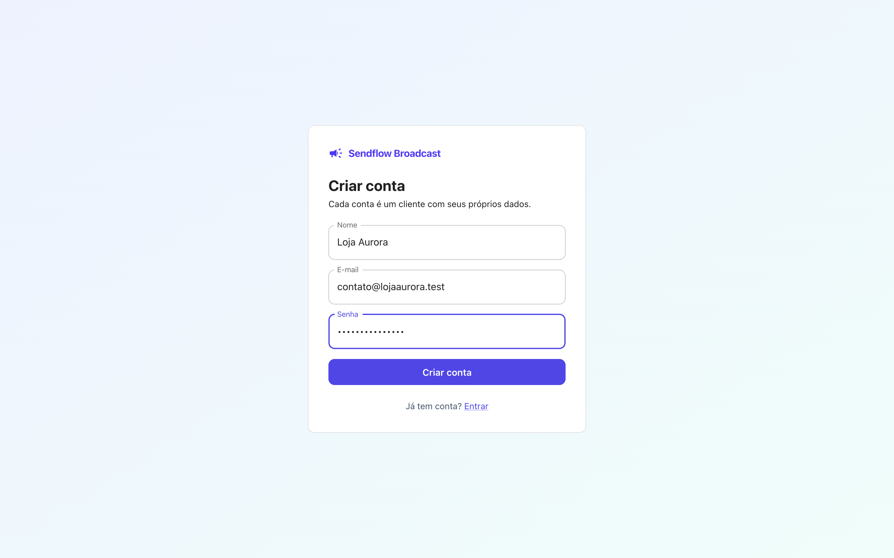 | 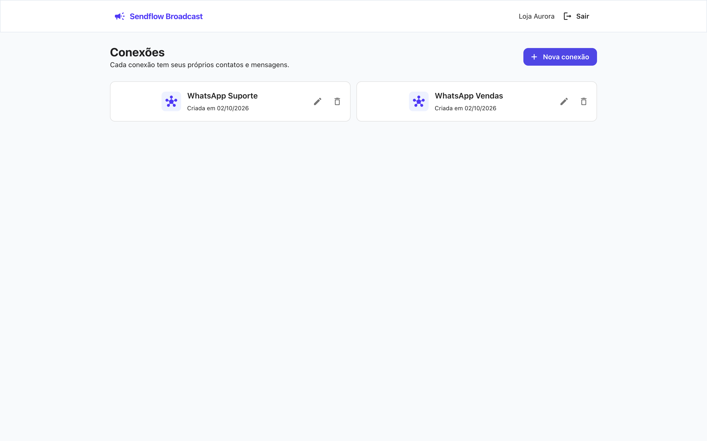 |

### Contatos

| Novo contato (telefone com máscara ou DDI é normalizado) | Contatos da conexão |
|---|---|
| 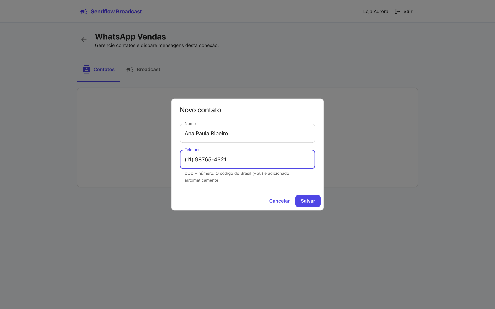 | 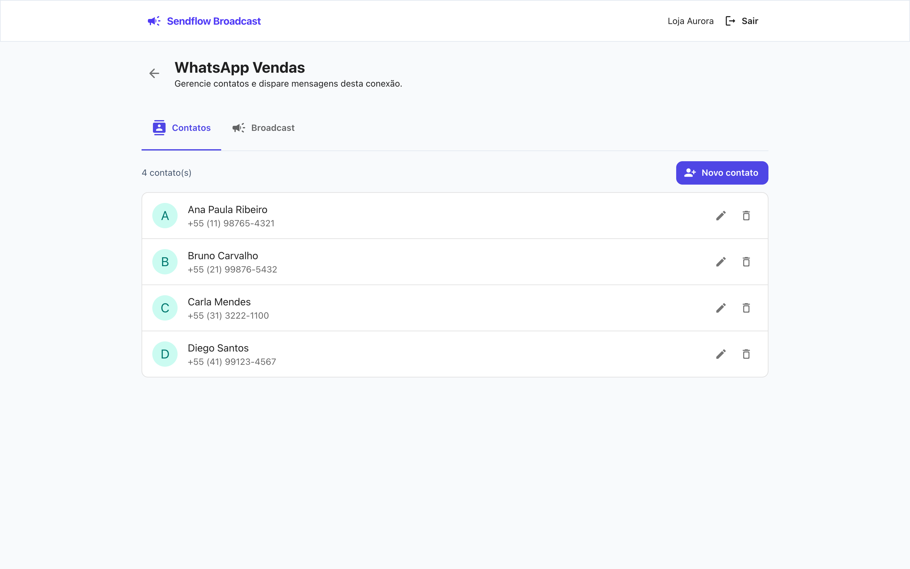 |

### Broadcast

| Agendando uma mensagem para contatos selecionados | Mensagens enviadas e agendadas, em tempo real |
|---|---|
| 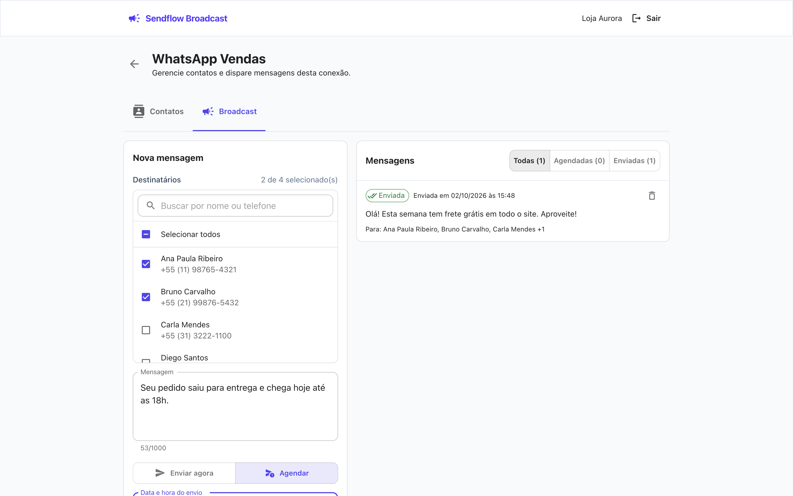 | 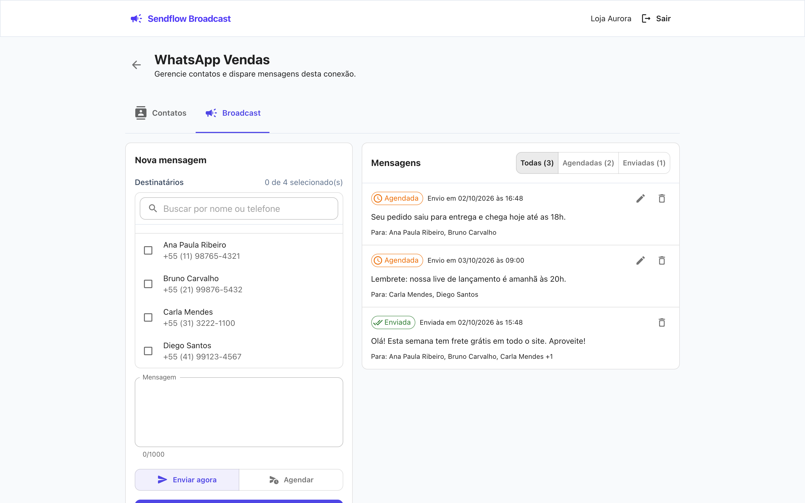 |

| Filtro por mensagens agendadas | Edição de uma mensagem agendada |
|---|---|
| 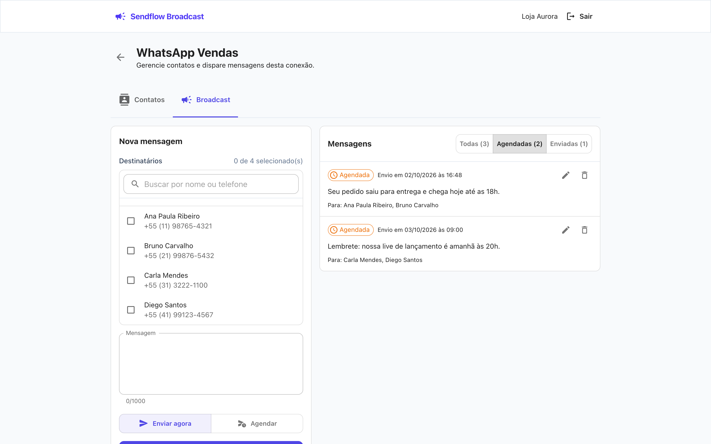 | 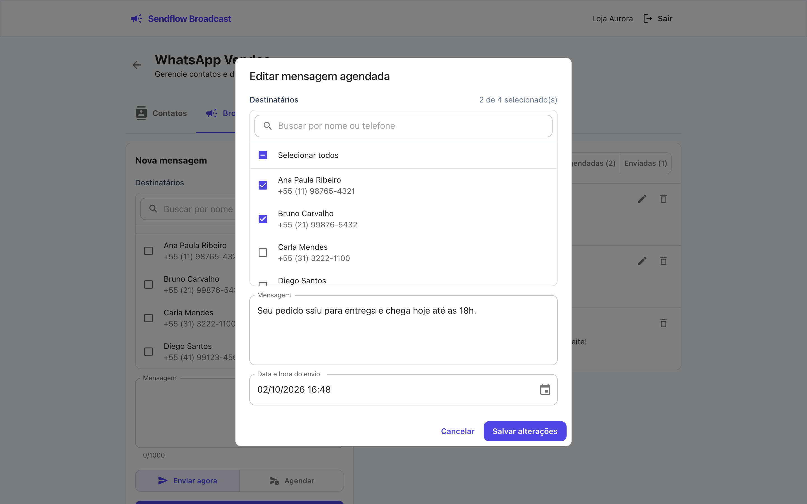 |

### Isolamento entre clientes e exclusão em cascata

| Mercado Central abre a URL de uma conexão da Loja Aurora e é redirecionado | Excluir uma conexão remove seus contatos e mensagens |
|---|---|
| 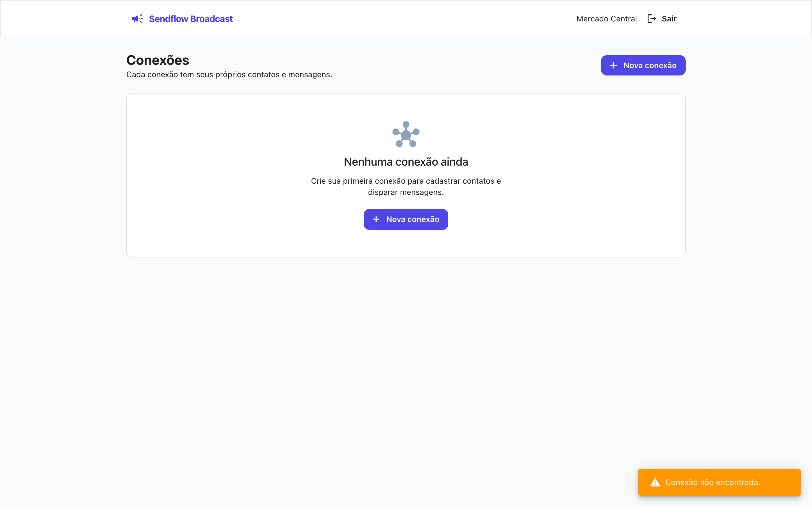 | 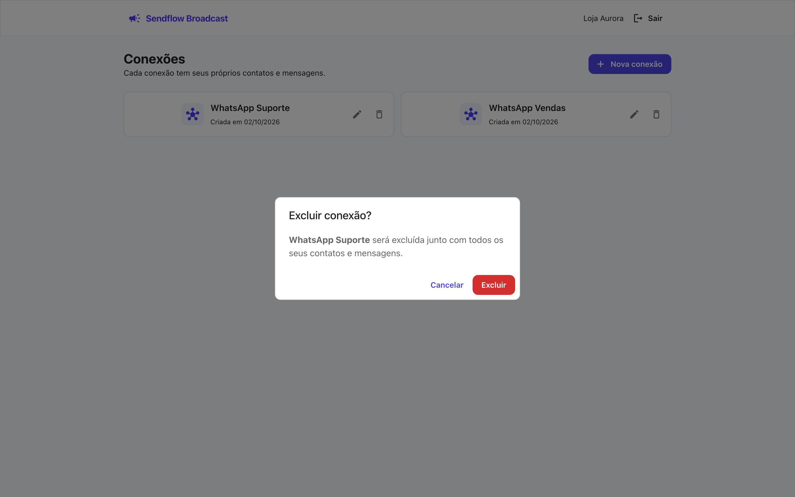 |

### Backend

| Authentication: um usuário por cliente | `clients`: perfil do cliente (id = uid) |
|---|---|
| 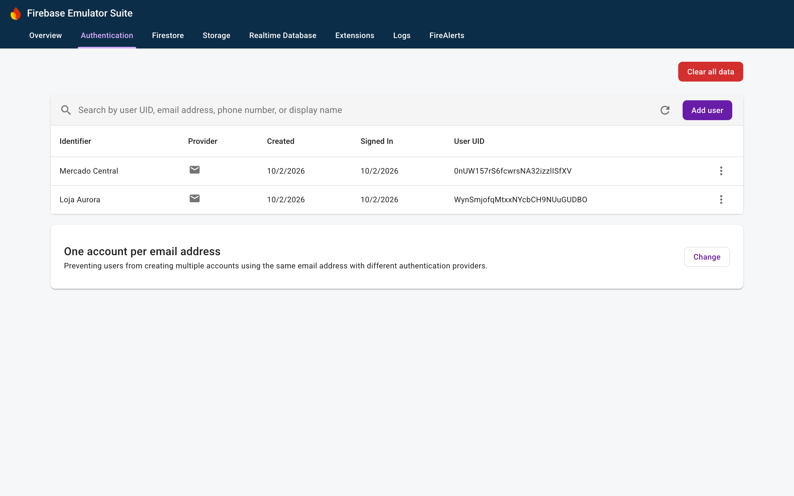 | 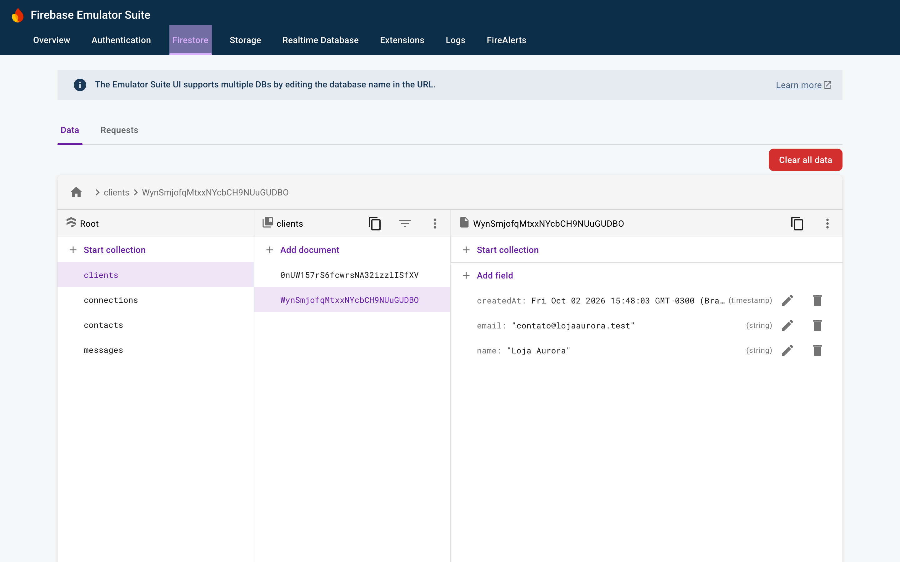 |

| `connections`: `tenantId` em cada documento | `contacts`: `connectionId` no lugar de subcoleção |
|---|---|
| 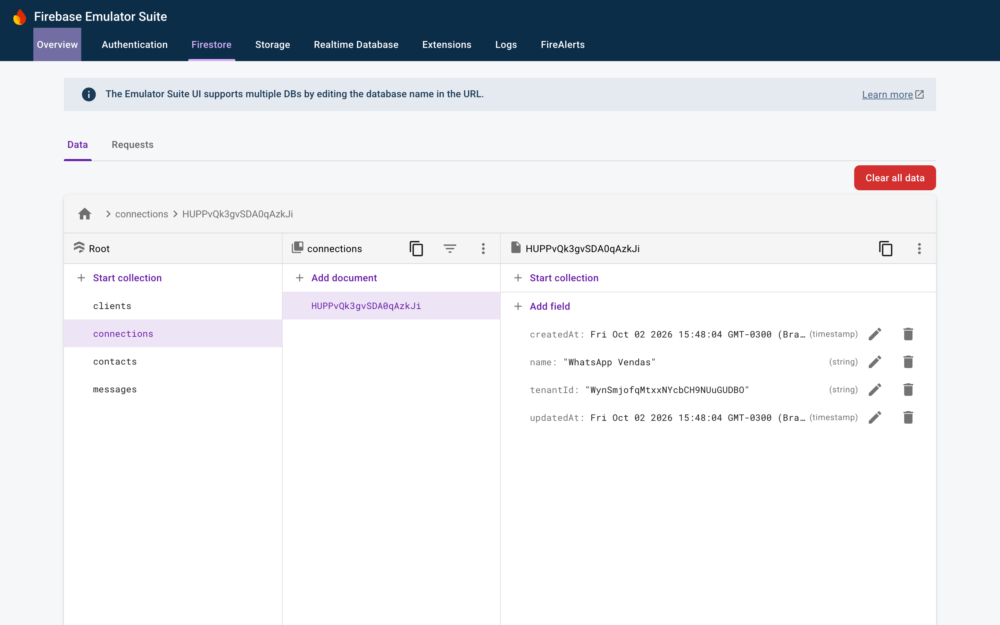 | 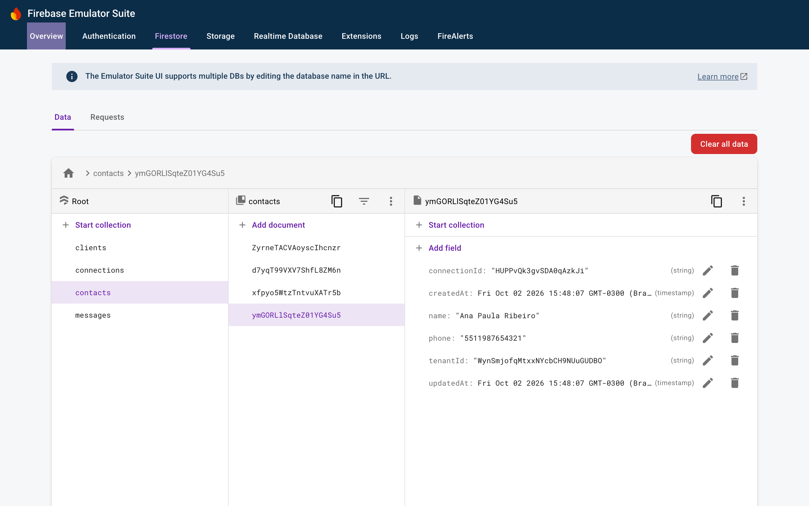 |

| `messages`: status, agendamento e snapshot dos destinatários | Cloud Function `onConnectionDeleted` executando a cascata |
|---|---|
| 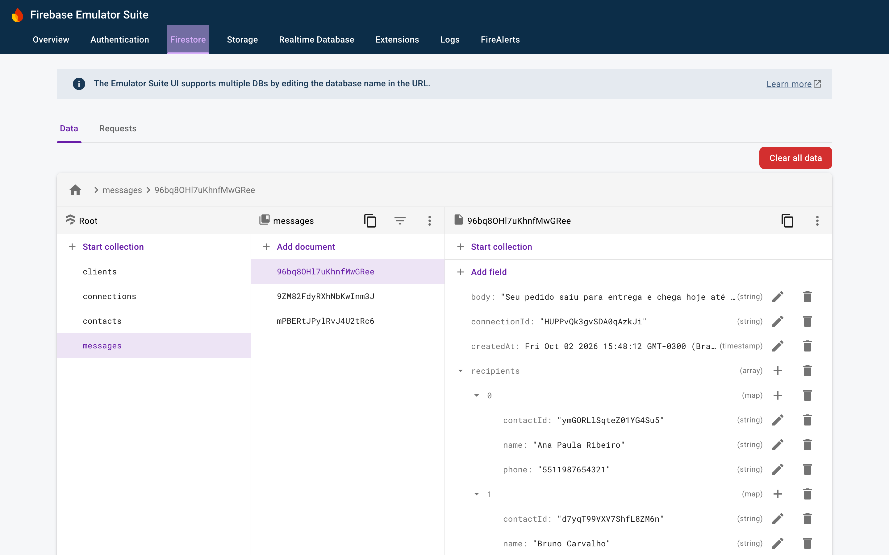 | 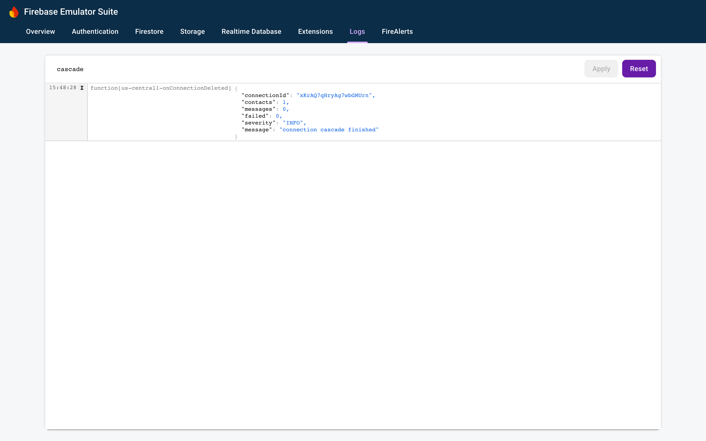 |

## Estrutura

```
.
├── web/            # frontend (Vite)
├── functions/      # Cloud Functions
├── rules-tests/    # testes das Security Rules
├── firestore.rules
├── firestore.indexes.json
└── firebase.json
```

Os três pacotes são independentes (cada um com seu `package.json`) para que as functions sejam publicadas sem dependências do frontend.

No frontend o código é organizado por feature (`auth`, `connections`, `contacts`, `messages`). Cada feature segue o mesmo formato:

- `schema.ts` – schemas zod, que são a fonte dos tipos e das validações
- `api.ts` – funções de escrita no Firestore
- `hooks.ts` – leituras em tempo real (`onSnapshot`)
- `components/` – UI, que nunca acessa o Firestore diretamente

Não há classes no projeto; tudo é feito com funções, hooks e composição.

## Modelagem

Sem subcoleções: todas as coleções ficam na raiz e a hierarquia é representada por referências.

```
clients/{uid}         name, email, createdAt
connections/{id}      tenantId, name, createdAt, updatedAt
contacts/{id}         tenantId, connectionId, name, phone, createdAt, updatedAt
messages/{id}         tenantId, connectionId, body, recipients[], status,
                      scheduledAt, sentAt, createdAt, updatedAt
```

- `tenantId` é o `uid` do usuário no Firebase Auth e está presente em **todos** os documentos. Isso permite que as regras validem o dono com uma comparação direta, sem precisar subir na hierarquia.
- `connectionId` faz o papel que o caminho de uma subcoleção faria.
- `recipients` guarda uma cópia (`contactId`, `name`, `phone`) dos destinatários no momento do envio. Uma mensagem enviada é um registro histórico e não deve mudar se o contato for editado ou excluído depois.
- Telefones são normalizados para dígitos com DDI (`5511988887777`).

## Isolamento entre clientes

O isolamento é garantido pelas Security Rules (`firestore.rules`), não pelo frontend:

- Leitura, edição e exclusão só são permitidas quando `resource.data.tenantId == request.auth.uid`.
- Na criação, o documento precisa ter `tenantId` igual ao `uid` de quem escreve.
- Contatos e mensagens só podem ser criados em uma conexão do próprio cliente (a regra faz `get()` na conexão e confere o dono).
- `tenantId` e `connectionId` são imutáveis.
- Os campos de cada documento são validados (`hasOnly`, tipos e tamanhos), e `createdAt`/`updatedAt` precisam vir de `serverTimestamp()`.
- O status da mensagem nunca é alterado pelo cliente. Ele pode criar uma mensagem já enviada (com `sentAt == request.time`) ou agendada para o futuro, e só pode editar mensagens que ainda estão agendadas. A transição para "Enviada" é feita somente pelo backend.

As consultas do frontend sempre filtram por `tenantId`. Como as regras do Firestore não funcionam como filtro, uma consulta sem esse filtro seria rejeitada inteira.

Se um dia um cliente tiver vários usuários, basta mover o `tenantId` para um custom claim no token e comparar com `request.auth.token.tenantId`; a modelagem continua a mesma.

## Agendamento

`dispatchScheduledMessages` é uma função `onSchedule` que roda a cada minuto e:

1. busca mensagens com `status == "scheduled"` e `scheduledAt <= agora` (índice composto `status + scheduledAt`), paginando por cursor;
2. marca cada uma como enviada com `BulkWriter`, usando `lastUpdateTime` como precondição.

A precondição evita uma condição de corrida: se o usuário reagendar a mensagem entre a leitura e a escrita, a escrita falha e a próxima execução lê o estado atualizado. A operação é idempotente, então não há retry; o que falhar em um minuto é processado no seguinte.

Optei pela varredura periódica em vez de Cloud Tasks (uma tarefa por mensagem) porque ela não guarda estado fora do Firestore: editar ou excluir uma mensagem agendada não exige cancelar nada. O custo é uma precisão de até ~1 minuto, aceitável para esse caso. Se fosse necessário precisão de segundos, Cloud Tasks seria o próximo passo.

A lógica fica em funções puras (`dispatch.core.ts`) e em `runDispatch(db, now)`, que recebe as dependências por parâmetro; o handler da função só faz a ligação com o Firebase.

## Exclusão em cascata

Sem subcoleções, apagar uma conexão deixaria contatos e mensagens órfãos. O trigger `onConnectionDeleted` remove os documentos filhos (filtrando por `connectionId` e `tenantId`) no backend, então a limpeza acontece mesmo que o usuário feche a aba logo após excluir.

## Tempo real

Listas de conexões, contatos e mensagens usam `onSnapshot` através de um hook genérico (`useFirestoreQuery`). Quando a função agendada marca uma mensagem como enviada, a tela atualiza sozinha. Escritas aparecem na hora graças ao cache local do SDK.

## Rodando localmente com o emulador

Dá para testar o fluxo completo, incluindo as Cloud Functions, sem nenhum projeto real, usando o Firebase Emulator Suite.

Requisitos: Node 22 (`.nvmrc`), Java 11+ (o emulador do Firestore roda em Java) e Firebase CLI (`npm install -g firebase-tools`).

1. Instale as dependências:

   ```bash
   npm --prefix web install
   npm --prefix functions install
   npm --prefix rules-tests install
   ```

2. Crie `web/.env.development.local` apontando para o emulador:

   ```bash
   VITE_FIREBASE_API_KEY=demo-key
   VITE_FIREBASE_AUTH_DOMAIN=demo-sendflow.firebaseapp.com
   VITE_FIREBASE_PROJECT_ID=demo-sendflow
   VITE_FIREBASE_APP_ID=demo-app
   VITE_USE_EMULATORS=true
   ```

3. Suba os emuladores de Auth, Firestore e Functions (terminal 1):

   ```bash
   npm --prefix functions run build
   firebase emulators:start --only auth,firestore,functions --project demo-sendflow
   ```

   O terminal mostra o endereço da interface do emulador (por padrão http://127.0.0.1:4000), onde dá para ver usuários, documentos e logs das functions.

4. Rode o frontend (terminal 2) e acesse http://localhost:5173:

   ```bash
   npm --prefix web run dev
   ```

5. O emulador não dispara funções agendadas sozinho. Depois que o horário de uma mensagem agendada passar, simule uma execução do agendador (terminal 3):

   ```bash
   npm --prefix functions run dispatch:local
   ```

   A mensagem muda para "Enviada" na tela em tempo real. A exclusão em cascata roda automaticamente no emulador ao excluir uma conexão.

Para rodar os testes automatizados (regras, functions e frontend):

```bash
firebase emulators:exec --only firestore --project demo-sendflow "npm --prefix rules-tests test && npm --prefix functions test"
npm --prefix web test
```

## Testes e CI

As Security Rules (isolamento entre clientes, validações e controle de status), as Cloud Functions (agendamento e exclusão em cascata) e a lógica do frontend (validações, normalização de telefone, filtros) têm testes automatizados, executados pelo GitHub Actions (`.github/workflows/ci.yml`) a cada push e pull request.
